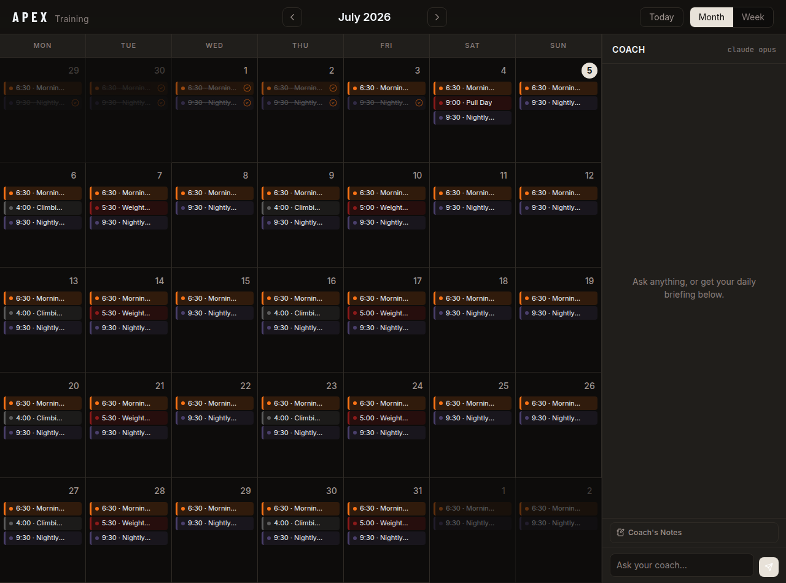
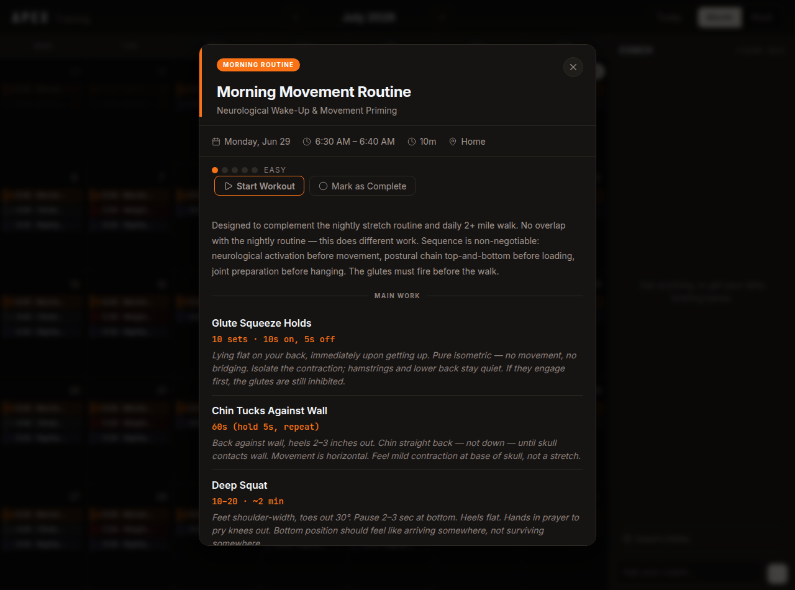
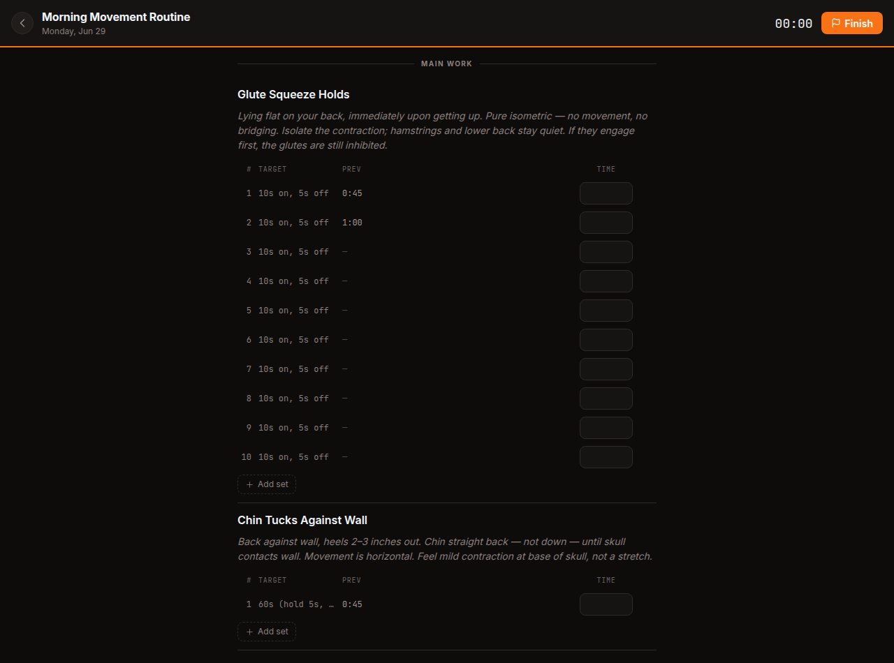

# Apex Training

A personal training calendar, workout tracker, and AI coach — one app for planning the week, logging the work, and getting a straight answer about how it went.

## ✨ Highlights

- 📅 **Calendar-first planning** — month, week, and day views with recurring events (RFC 5545 RRULE subset), per-instance skips, and realtime sync across devices
- 🏋️ **Live workout tracker** — per-set logging against planned targets, debounced autosave, tap-to-fill from your previous session, and skipped sets recorded honestly as zeros
- 🏆 **Personal records, computed not hallucinated** — estimated 1RM (Epley), duration, rep, distance, and elevation PRs detected client-side from raw history; the AI only narrates them
- 🤖 **AI coach** — daily briefing, chat, and post-workout summaries powered by Claude; schedule changes go through tool calls that always require your confirmation
- 🔗 **Calendar feed** — subscribe from Apple/Google Calendar via a standards-compliant ICS endpoint, recurring events and exceptions included
- 📴 **Graceful offline mode** — no Supabase configured? Everything still works from the bundled schedule with localStorage persistence

## Overview

Apex Training is a single-user web app: a React SPA served by Vercel, with a thin layer of serverless functions in [`api/`](api/) in front of a Supabase Postgres database. The browser reads with the anon key under SELECT-only RLS policies; every write goes through the API layer, which holds the service-role key. AI calls (chat and coach summaries) are proxied through the same API layer so the Anthropic key never reaches the browser.

The guiding design principle: **deterministic data is computed client-side; the AI narrates, it never derives.** Personal records, completion rates, and schedule state are calculated by pure, unit-tested modules in [`src/lib/`](src/lib/) — the coach is handed pre-computed facts and told not to invent others.

Built by [@shanehaynes](https://github.com/shanehaynes) as a personal tool; the product and engineering specs live in [PRD.md](PRD.md), [RECURRENCE_ENGINE_SPEC.md](RECURRENCE_ENGINE_SPEC.md), and [WORKOUT_TRACKING_SPEC.md](WORKOUT_TRACKING_SPEC.md).

## 📸 Screenshots

The month view, with the coach sidebar alongside:



Opening an event shows the full session plan; **Start Workout** launches the tracker:



The tracker: planned targets, previous-session values (tap to fill), and free-text actuals per set:



## 🗺️ Architecture

```
src/
  components/        # presentational React (calendar, tracker, modal, chat, layout)
  context/           # React state distribution only (CalendarContext, ScheduleContext)
  hooks/             # useChat (NDJSON streaming), useWorkoutSession (tracker lifecycle)
  lib/               # pure, unit-tested domain logic
    recurrence/      #   RRULE parse/validate/serialize/expand
    schedule/        #   event expansion, row mapping, occurrence ids
    tracking/        #   tracker model, PR detection, session data access
    coach/           #   system prompt, tool registry, wire protocol
    db/              #   row types shared with api/ (single source of truth)
api/                 # Vercel serverless functions (service-role writes, AI proxy)
supabase/            # schema.sql + ordered migrations
```

| Endpoint | Purpose |
|----------|---------|
| `POST /api/events`, `PATCH/DELETE /api/events?id=` | Event CRUD with an append-only mutation log |
| `POST /api/event-instances` | Skip one occurrence of a recurring event |
| `POST /api/completions` | Completion toggles + history log |
| `POST /api/workout-sessions` | Tracker writes: start / save / finish / cancel / summary |
| `POST /api/chat` | Streams the coach chat (NDJSON) via Claude, server-side key |
| `POST /api/coach-summary` | One-shot post-workout summary |
| `GET /api/calendar-feed` | ICS feed with RRULEs and EXDATEs (floating local times) |

## 🚀 Getting started

You'll need **Node 20+**, a [Supabase](https://supabase.com) project, and an [Anthropic API key](https://console.anthropic.com/settings/keys).

```bash
npm install
cp .env.example .env.local   # then fill in the values
```

| Variable | Scope | Purpose |
|----------|-------|---------|
| `VITE_SUPABASE_URL` | client + server | Supabase project URL |
| `VITE_SUPABASE_ANON_KEY` | client | anon/public key (SELECT-only under RLS) |
| `SUPABASE_SERVICE_ROLE_KEY` | server only | used by `api/` functions for writes |

The AI coach runs on each user's own Anthropic API key, saved in-app under Profile → AI Coach (stored server-side, never exposed to the browser).

**Database:** run [`supabase/schema.sql`](supabase/schema.sql) in the Supabase SQL editor, then the files in [`supabase/migrations/`](supabase/migrations/) in filename order (phase2 → phase5).

**Run it:**

```bash
npm run dev        # Vite dev server — UI + Supabase reads
```

Plain `vite` dev does not run the serverless functions, so writes and AI features degrade gracefully (logged and toasted, never crashing). To exercise the full stack locally, use [`vercel dev`](https://vercel.com/docs/cli/dev) instead.

## ☁️ Deployment

Deploys as a standard Vite app on Vercel ([vercel.json](vercel.json)). Set the environment variables from the table above in **Settings → Environment Variables** and redeploy. Only `VITE_`-prefixed variables are exposed to the client bundle — keep the service-role key unprefixed.

To subscribe from a calendar app, add `https://<your-deployment>/api/calendar-feed` as a URL/ICS subscription.

## 🧑‍💻 Development

```bash
npm run dev        # dev server
npm test           # vitest — pure-logic suites in src/lib + api handler tests
npm run lint       # oxlint
npm run build      # tsc -b + vite build
```

The domain logic (recurrence expansion, tracker model synthesis, PR detection, occurrence ids, chat wire protocol, tool dispatch) is deliberately React-free and covered by the test suite — start there when changing behavior. UI changes can be verified headlessly with the driver in `.claude/skills/run-apex-training/`, which runs the app against a stubbed backend and screenshots the calendar and tracker flows.

## 💬 Feedback

This is a personal project, but if something here is useful to you — or broken — [issues](https://github.com/shanehaynes/apex-training/issues) are welcome.
