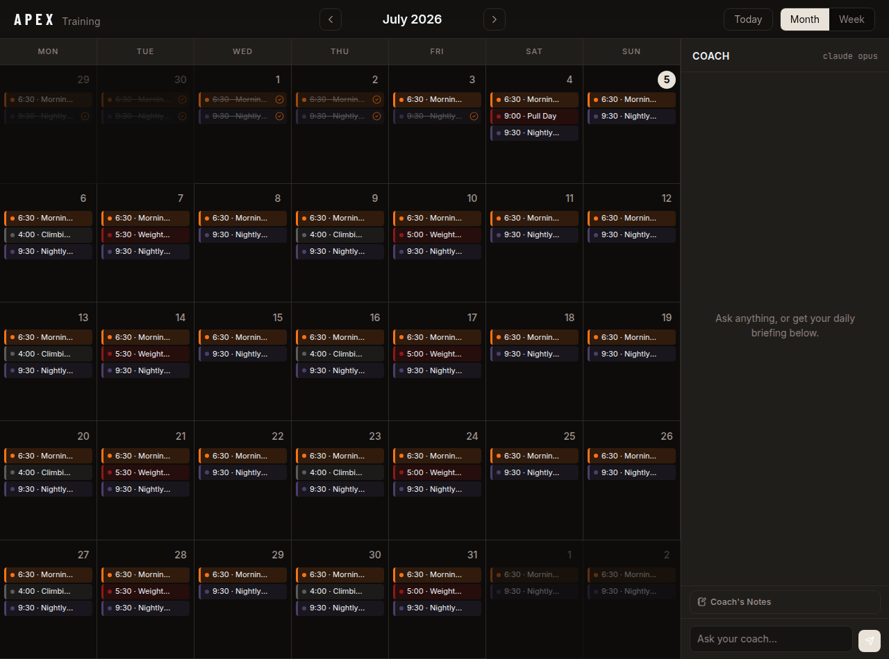
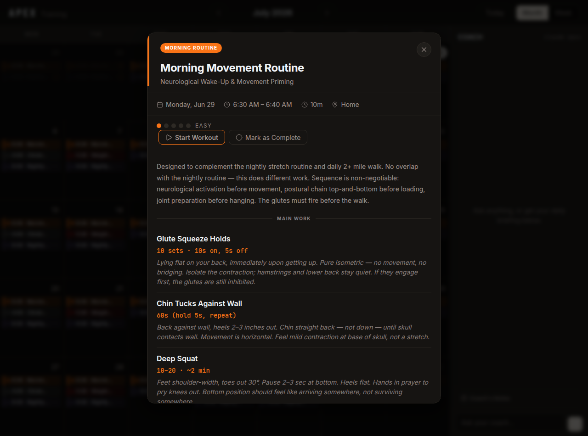
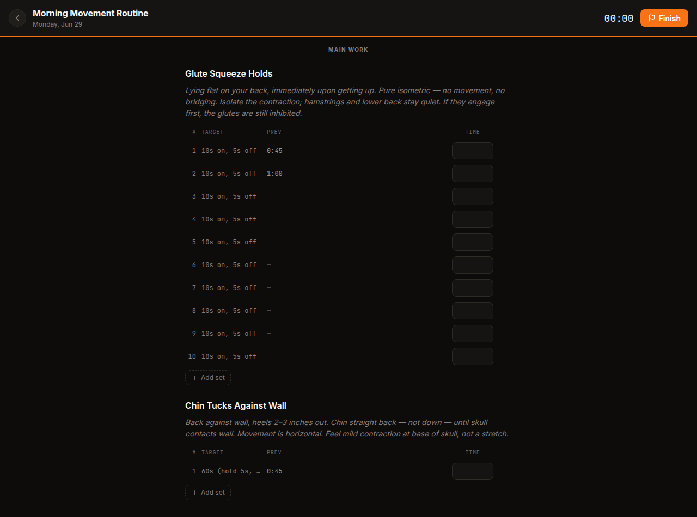

# Apex Training

A personal training calendar, workout tracker, and AI coach — one app for planning the week, logging the work, and getting a straight answer about how it went.

## ✨ Highlights

- 📅 **Calendar-first planning** — month, week, and day views with recurring events (RFC 5545 RRULE subset), per-instance skips, and realtime sync across devices
- 🏋️ **Live workout tracker** — per-set logging against planned targets, debounced autosave, tap-to-fill from your previous session, and skipped sets recorded honestly as zeros
- 🏆 **Personal records, computed not hallucinated** — estimated 1RM (Epley), duration, rep, distance, and elevation PRs detected client-side from raw history; the AI only narrates them
- 🤖 **AI coach** — daily briefing, chat, and post-workout summaries powered by Claude; schedule changes go through tool calls that always require your confirmation
- 🔗 **Calendar feed** — subscribe from Apple/Google Calendar via a standards-compliant ICS endpoint, recurring events and exceptions included
- 📴 **Graceful offline mode** — no Supabase configured? Everything still works from the bundled schedule with localStorage persistence

Using the app rather than working on it? [WELCOME.md](WELCOME.md) is the user guide — every feature, one short section each.

## Overview

Apex Training is a small multi-user web app (invite-only, a handful of accounts): a React SPA served by Vercel, with a thin layer of serverless functions in [`api/`](api/) in front of a Supabase Postgres database. Every table is under per-user RLS — a signed-in browser reads only its own rows, and an unauthenticated one gets zero rows from every table. Writes all go through the API layer, which holds the service-role key and checks the caller's JWT. AI calls (chat and coach summaries) are proxied through the same API layer, on **each user's own Anthropic key**, stored server-side and encrypted at rest — no Anthropic key ever reaches the browser.

The guiding design principle: **deterministic data is computed client-side; the AI narrates, it never derives.** Personal records, completion rates, and schedule state are calculated by pure, unit-tested modules in [`src/lib/`](src/lib/) — the coach is handed pre-computed facts and told not to invent others.

Built by [@shanehaynes](https://github.com/shanehaynes) as a personal tool; the product and engineering specs live in [PRD.md](PRD.md), [RECURRENCE_ENGINE_SPEC.md](RECURRENCE_ENGINE_SPEC.md), and [WORKOUT_TRACKING_SPEC.md](WORKOUT_TRACKING_SPEC.md).

## 📸 Screenshots

The month view, with the coach sidebar alongside:



Opening an event shows the full session plan; **Start Workout** launches the tracker:



The tracker: planned targets, previous-session values (tap to fill), and free-text actuals per set:



## 🗺️ Architecture

```
src/
  components/        # presentational React (calendar, tracker, modal, chat, auth, profile)
  context/           # React state distribution only (Auth, Schedule, Calendar, Blocks, Meals)
  hooks/             # useChat (NDJSON streaming), useWorkoutSession (tracker lifecycle)
  lib/               # pure, unit-tested domain logic
    recurrence/      #   RRULE parse/validate/serialize/expand
    schedule/        #   event expansion, row mapping, occurrence ids
    tracking/        #   tracker model, PR detection, session data access
    coach/           #   system prompt, tool registry, wire protocol, model.ts
    blocks/          #   training blocks: periods, targets vs. actuals, cycles
    nutrition/       #   meal parsing and macro rollups
    review/          #   period stats + recap copy for the review emails
    db/              #   row types shared with api/ (single source of truth)
api/                 # 4 Vercel serverless functions (service-role writes, AI proxy)
  [...path].ts       #   catch-all: Hono router (_lib/app.ts) → _lib/handlers/*
  chat.ts            #   standalone: streaming coach chat
  review-cron.ts     #   standalone: daily review-email cron
  calendar-feed.ts   #   standalone: per-user ICS feed
supabase/            # schema.sql + ordered phaseN migrations
evals/               # adversarial eval suite for the coach (see evals/README.md)
```

Only root-level `api/*.ts` files become Vercel serverless functions, and the repo deliberately keeps that at **four** — everything else routes through `[...path].ts` into [`api/_lib/handlers/`](api/_lib/handlers/). CI fails if a fifth appears (see the function-count guard in [ci.yml](.github/workflows/ci.yml)); new endpoints belong behind the router, not at the root.

| Endpoint | Purpose |
|----------|---------|
| `POST /api/events`, `PATCH/DELETE /api/events?id=` | Event CRUD with an append-only mutation log |
| `POST /api/event-instances` | Skip one occurrence of a recurring event |
| `POST /api/completions` | Completion toggles + history log |
| `POST /api/workout-sessions` | Tracker writes: start / save / finish / cancel / summary |
| `POST/PATCH/DELETE /api/blocks`, `/api/objectives` | Training blocks (weekly targets, non-overlapping Monday-aligned ranges) & objectives |
| `POST/PATCH/DELETE /api/meals`, `POST/DELETE /api/meal-favorites` | Meal logging and saved favorites |
| `POST/PATCH /api/exercise-definitions` | Exercise library writes (reads come from Supabase directly) |
| `GET/PATCH /api/profile` | Profile, coach fields, and the per-user Anthropic key |
| `POST /api/template-copy` | Seed a new account from the template user's recurring workouts |
| `GET /api/mutations-log` | Append-only mutation history |
| `POST /api/chat` | Streams the coach chat (NDJSON) via Claude, per-user key |
| `POST /api/coach-summary` | One-shot post-workout summary |
| `GET /api/calendar-feed` | Per-user tokened ICS feed with RRULEs and EXDATEs (floating local times) |

## 🚀 Getting started

You'll need **Node 20+** (CI runs 22) and a [Supabase](https://supabase.com) project. An [Anthropic API key](https://console.anthropic.com/settings/keys) is needed for the coach, but it isn't an env var — each user saves their own in the app (see below).

```bash
npm install
cp .env.example .env.local   # then fill in the values
```

| Variable | Scope | Purpose |
|----------|-------|---------|
| `VITE_SUPABASE_URL` | client + server | Supabase project URL |
| `VITE_SUPABASE_ANON_KEY` | client | anon/public key (SELECT-only under RLS) |
| `SUPABASE_SERVICE_ROLE_KEY` | server only | used by `api/` functions for writes |
| `CRON_SECRET` | server only | bearer token guarding `/api/review-cron` (Vercel sends it on cron runs) |
| `GMAIL_USER` | server only | Gmail address review emails are sent from (also the From) |
| `GMAIL_APP_PASSWORD` | server only | 16-char [app password](https://myaccount.google.com/apppasswords) for that account (needs 2-Step Verification on) |
| `API_KEY_ENCRYPTION_SECRET` | server only | encrypts stored per-user Anthropic keys at rest (AES-256-GCM, [`api/_lib/keyCrypto.ts`](api/_lib/keyCrypto.ts)). Any long random string — `openssl rand -base64 32`. Leave it unset and keys are stored in plaintext, with a loud server-log warning on every save; set it later and existing rows are re-encrypted on first read. Rotating it invalidates saved keys (users just re-save) |
| `SEED_SOURCE_USER_ID` | server only | the account whose recurring workouts seed new users via `/api/template-copy`; falls back to the `profiles` row with `is_template_source = true` |

There is **no `ANTHROPIC_API_KEY`** — the coach runs on each user's own Anthropic key, saved in-app under Profile → AI Coach, verified against Anthropic on save and stored server-side (the browser only ever sees the last 4 characters).

**Database:** run [`supabase/schema.sql`](supabase/schema.sql) once on a fresh project, then the files in [`supabase/migrations/`](supabase/migrations/) in **numeric** phase order — phase2 → phase30, *not* filename sort, which puts phase10 before phase2. [`scripts/db-reset-local.sh`](scripts/db-reset-local.sh) does this for a local stack by globbing `phase*.sql` through `sort -V`, so new migrations must keep the `phaseN_*.sql` naming to be picked up. **Next free number: phase31.**

**Run it:**

```bash
npm run dev        # Vite dev server — UI + Supabase reads
```

Plain `vite` dev does not run the serverless functions, so writes and AI features degrade gracefully (logged and toasted, never crashing). To exercise the full stack locally, use [`vercel dev`](https://vercel.com/docs/cli/dev) instead.

## ☁️ Deployment

Deploys as a standard Vite app on Vercel ([vercel.json](vercel.json)). Set the environment variables from the table above in **Settings → Environment Variables** and redeploy. Only `VITE_`-prefixed variables are exposed to the client bundle — keep the service-role key unprefixed.

To subscribe from a calendar app, add `https://<your-deployment>/api/calendar-feed` as a URL/ICS subscription.

To query your training data from Claude, ChatGPT, or any MCP client, connect to `https://<your-deployment>/api/mcp` — setup per client in [CONNECTORS.md](CONNECTORS.md).

## ⌚ Watch sync (COROS)

Connect a COROS account in **Profile → COROS** (an OAuth sign-in on COROS's
site — Apex never sees your COROS password) and a **Sync** button appears in
the calendar toolbar. Pressing it pulls recent activities through COROS's
official MCP server:

- An activity that **matches a planned workout** (same day, compatible type)
  asks per item: **Fill it** completes the planned event with your measured
  data; **Keep separate** imports it as its own event. The planned event's
  targets are never overwritten — actuals live beside them, and count toward
  PRs like hand-logged work.
- **Unmatched activities** import on their own as completed events.
- Distance, elevation, average/max heart rate, and calories come along, and
  the workout detail shows a heart-rate chart, elevation profile, and route
  outline decoded from the activity's FIT file (drawn locally — GPS
  coordinates are never sent to a map-tile server).
- An import ledger guarantees **no duplicates**, ever — pressing Sync twice,
  or after the nightly job already ran, just reports "Everything up to date."

**Nightly auto-sync**: every connected account also syncs automatically once
a day (03:30 UTC ≈ 11:30 PM Eastern). The nightly job imports unmatched
activities by itself but **never auto-fills a planned workout** — matches
wait for your decision, and the Sync button wears a badge with the count
until you confirm them. Toggle the nightly sync per provider in Profile →
COROS. Local calendar dates use the timezone your browser reported on your
last manual sync.

Support for Garmin and Apple Health is planned on the same plumbing —
connections, dedup, matching, and the nightly job are already
provider-generic.

Setup (per deployment): run `supabase/migrations/phase27_provider_sync.sql`
and `phase29_auto_sync.sql`, register an OAuth client with COROS
(`node scripts/coros-spike.mjs register https://<your-domain>/api/provider-callback`),
and set `COROS_CLIENT_ID` + `COROS_REDIRECT_URI` in Vercel. The nightly job
reuses `CRON_SECRET`. To test the cron against one account:

```bash
curl -H "Authorization: Bearer $CRON_SECRET" \
  "https://<your-deployment>/api/provider-cron?dryRun=1&userId=<uid>"
```

## 📬 Review emails

A daily Vercel cron (`/api/review-cron`, 14:00 UTC) emails each user a review when a training period ends. A "month" is 4 ISO weeks (Mon–Sun) — 13 per year, with month 13 absorbing week 53 in 53-week ISO years — and the yearly review goes out in the first weeks of the new ISO year. Stats (sessions, training time, weight moved, distance, elevation, PRs) are computed deterministically in [`src/lib/review/`](src/lib/review/); users with an Anthropic key saved also get a short coach's note (per-user key, same as chat), and everyone else gets the numbers. Email is sent over Gmail SMTP ([`api/_lib/mailer.ts`](api/_lib/mailer.ts)) — no sending domain to verify. Sent reviews are recorded in the `reviews` table (phase12 migration), which doubles as the double-send guard.

Setup: run `supabase/migrations/phase12_reviews.sql`, create a Gmail [app password](https://myaccount.google.com/apppasswords) (2-Step Verification must be on), and set `CRON_SECRET`, `GMAIL_USER`, and `GMAIL_APP_PASSWORD` in Vercel. To test against one account:

```bash
curl -H "Authorization: Bearer $CRON_SECRET" \
  "https://<your-deployment>/api/review-cron?dryRun=1&userId=<uid>&periodType=month&isoYear=2026&monthIndex=6"
```

Drop `dryRun=1` to actually generate and send that period; the normal daily run needs no parameters.

## 🤖 How the coach is wired

Notes that are easy to get wrong when editing the AI path:

- **The model id lives in exactly one place:** `COACH_MODEL` in [`src/lib/coach/model.ts`](src/lib/coach/model.ts). `api/chat.ts`, the coach-summary handler, `REVIEW_MODEL`, the chat sidebar's badge, and the eval suite's production arm all import it. A model bump is a one-line change there — never edit model strings in `api/chat.ts`, `coachSummary.ts`, `recap.ts`, or `evals/src/models.ts`.
- **Prompt caching:** [`api/chat.ts`](api/chat.ts) sets three `ephemeral` cache breakpoints (last tool schema, system block, final message block), so each turn re-reads the tools, system prompt, and prior conversation prefix at cache-read pricing. Anything that perturbs those prefixes silently invalidates the cache — watch `usage.cache_read_input_tokens` in production after changing them.
- **Aborts propagate upstream:** the response's `close` event trips an `AbortController` passed to `client.messages.stream()`, so hitting Stop (or closing the tab) cancels the Anthropic generation instead of letting it bill to completion.
- **Confirmation cards resolve ids against live state.** The card labels come from looking the model-supplied `event_id`/`meal_id` up in current app state, not from the model's prose; an id that resolves to nothing is surfaced as such on the card. The `*_title` fields in the tool schemas still exist and the model still fills them, but they are display fallbacks only (used when there's no tool context — queued stream-time labels and evals). Confirm is latched synchronously by a ref, so a double-click cannot run an executor twice.

## 🧑‍💻 Development

```bash
npm run dev          # dev server
npm test             # vitest — pure-logic suites in src/lib + api handler tests
npm run e2e          # playwright, mock project (all writes stubbed)
npm run lint         # oxlint
npm run build        # tsc -b + vite build
npm run agent:check  # the pre-push gate: tsc -b && vitest && playwright --project=mock
npm run eval         # coach eval suite (needs ANTHROPIC_API_KEY) — see evals/README.md
```

`tsc -b` builds **five** strict projects — app, node, api, e2e, and `evals/` — all referenced from the root [tsconfig.json](tsconfig.json), so the eval harness is typechecked in CI like everything else. Run `npm run agent:check` before pushing.

[CI](.github/workflows/ci.yml) runs three jobs on every push and PR: **check** (build, unit tests, lint, a guard that fails if `api/` grows a fifth root-level function, and `npm audit --omit=dev --audit-level=high` on production deps), **e2e-mock** (Playwright against stubbed writes), and **full** (a real local Supabase stack: handler integration tests with real JWTs and RLS, plus live e2e). Dependabot ([dependabot.yml](.github/dependabot.yml)) batches weekly minor/patch updates into one PR per ecosystem and keeps majors and security fixes separate.

Two e2e invariants worth knowing before you touch the suite: the mock project's clock is **pinned to 2026-09-07** (`fakeNow` in [playwright.config.ts](playwright.config.ts)) because the bundled seed schedule only covers a fixed date range — the live project has no pin, since its rows are seeded off the real clock. And skips are enforced: [`e2e/lib/skipReporter.ts`](e2e/lib/skipReporter.ts) fails CI on any skip not listed in `EXPECTED_CI_SKIPS`, so a test that quietly stops running is a build failure rather than a green check.

The domain logic (recurrence expansion, tracker model synthesis, PR detection, occurrence ids, chat wire protocol, tool dispatch) is deliberately React-free and covered by the test suite — start there when changing behavior. UI changes can be verified headlessly with the driver in `.claude/skills/run-apex-training/`, which runs the app against a stubbed backend and screenshots the calendar and tracker flows.

## 💬 Feedback

This is a personal project, but if something here is useful to you — or broken — [issues](https://github.com/shanehaynes/apex-training/issues) are welcome.
